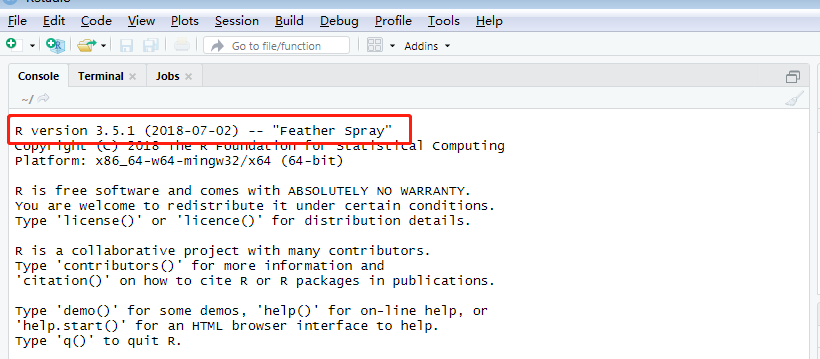
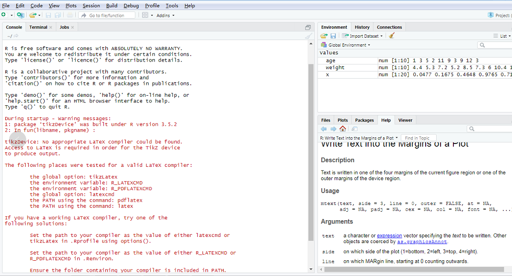
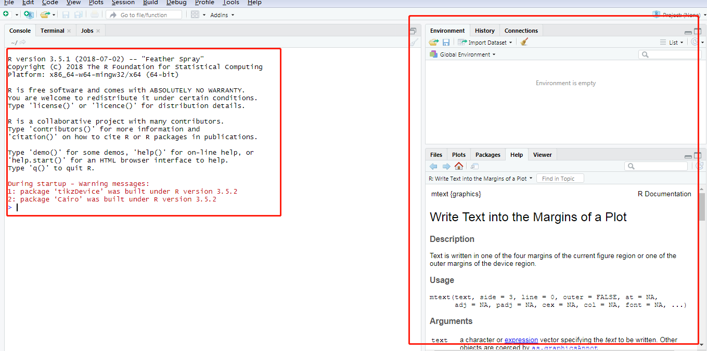

# Worktools安装指南详细版

1. 卸载电脑中已经安装的R和Rstudio和tex软件(卸载干净，不要有R残留），接着重启电脑。
2. 把worktools.RAR文件解压到C盘，然后把剩下的两个压缩文件解压到C盘（至少有20个G）

3. 在worktools文件夹中创建一个新的文件夹config
4. 点击RStudio-1.2.1335，将RStudio-1.2.1335安装到worktools文件夹中，点击RStudio-1.2.1335--bin--rstudio.exe,打开
界面如下：出现的是R version 3.5.1,进行下一步，如果出现的是其他版本的R,如3.6.1，则说明之前安装R没有卸载干净，
继续删除干净后，重启rstudio.exe，然后出现选择R版本的路径界面，选择C:\\Worktools\\R\\R-3.5.1，即可出现下图，关
联的是Worktools里的R-3.5.1

5. 安装anaconda3，直接安装在C盘，根目录下面(可在最后做）
6. 把C:\\Worktools\\Pandoc文件夹中的pandoc.exe，pandoc-citeproc.exe，pandoc-crossref.exe三个文件复制到C:\\Worktools
\\RStudio-1.2.1335\\bin\\pandoc 中，选择覆盖文件
7. 右键点击C:\\Worktools\\MobileWork中的run.bat，选择以管理员身份运行
8. 重启rstudio,出现以下界面，说明安装完成

# Worktools 更新步骤
1. worktools文件名改为worktools.bak 
2. 把移动硬盘里面的worktools用fastcopy.exe拷贝到C盘
3. 把 worktools.bak 里面的 config 文件夹复制到新的 worktools 里面
4. 测试，一个星期后没有问题就把worktools.bak删掉（需要30-60分钟） 
